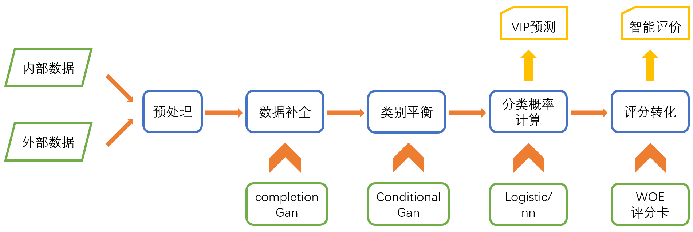

# <p align=center>classification</p>

### 流程图
<p align=center>

</p>

---

### 数据处理
* #### 预处理
    * 异常值处理
    * 归一化/标准化
* #### 数据补全
    * consistency Gan
    * ambient Gan
* #### 类别平衡
    * conditional Gan

---

### 预测方法
* #### 传统预测
    * AHP *层次分析法计算高分低分预测*
* #### ML算法预测(二分类)
    * LR *逻辑回归*
    * NN *神经网络*

### 数据集(*kaggle*)
    * [GiveMeSomeCredit](https://www.kaggle.com/c/GiveMeSomeCredit/data)

### 评分卡
*  #### WOE
    * [信用评分卡模型分数校准](https://zhuanlan.zhihu.com/p/82670834)
    * [风控模型—WOE与IV指标的深入理解应用](https://zhuanlan.zhihu.com/p/80134853)
    * [Platt scaling](https://blog.csdn.net/wosinihuo/article/details/80583409)

---

## Installation
```
$ pip install -r requirements.txt
```

